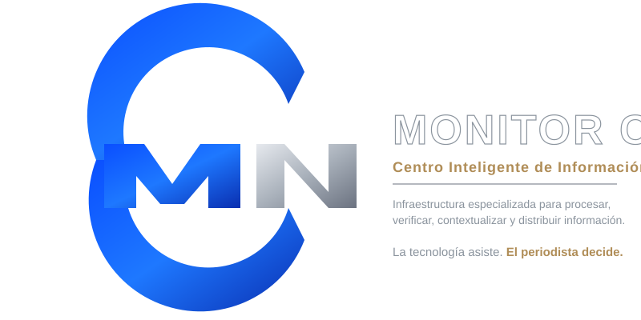
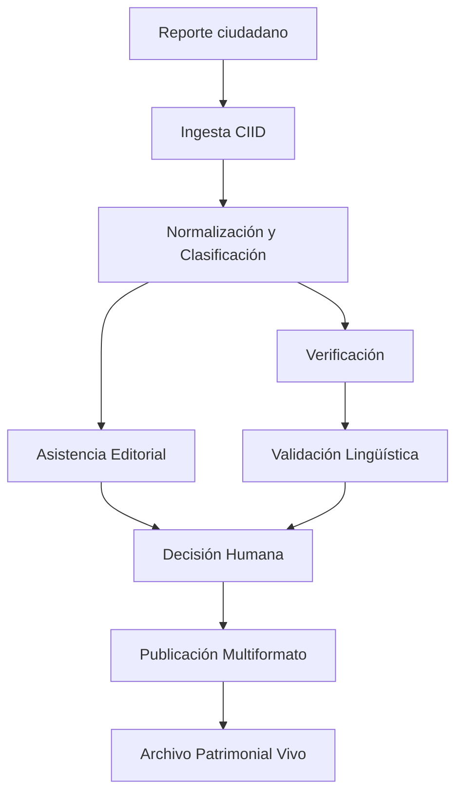

<div align="center">



# MONITOR CIID

**Centro Inteligente de Información Digital**

<p>
  
  
  
  
</p>

<p>
  <a href="https://monitorciid.netlify.app/?demo=2">Ver Demo en Vivo</a> ·
  <a href="#-arquitectura">Arquitectura</a> ·
  <a href="./docs/ROADMAP.md">Roadmap</a> ·
  <a href="./CONTRIBUTING.md">Contribuir</a>
</p>

<p><em>"La tecnología asiste. El periodista decide."</em></p>

</div>

---

## Concepto

**MONITOR CIID** es una infraestructura periodística de nueva generación que asiste al periodista en el procesamiento, verificación, distribución y preservación de información. Su diferencial clave: **la preservación del patrimonio cultural y lingüístico de las comunidades de Oaxaca**.

> **"El objetivo no es publicar más rápido. El objetivo es publicar mejor."**

## Características Clave

| Característica | Descripción |
| :--- | :--- |
| **Ingesta Ciudadana** | Reportes vía WhatsApp: texto, fotografía y audio en lengua originaria |
| **Normalización y Clasificación** | Detecta territorio, tema, actores y sensibilidad patrimonial |
| **Asistencia Editorial** | Genera borradores periodísticos estructurados |
| **Verificación y Contraste** | Regla de oro: ningún reporte se publica sin contraste |
| **Validación Lingüística** | Preserva significado, contexto, variante y cosmovisión |
| **Decisión Humana** | El periodista decide qué se publica |
| **Publicación Multiformato** | Web, redes, audio, lengua originaria, medios comunitarios |
| **Archivo Patrimonial Vivo** | La noticia se convierte en memoria digital de una comunidad |

## Quick Start

```bash
git clone https://github.com/Designdigitalestefania/monitorciid.git
cd monitorciid
python -m http.server 8080
# Demo interactiva: http://localhost:8080/?demo=2
# Comparativa:      http://localhost:8080/?demo=comp
```

Arquitectura



Pipeline Completo

# Etapa Descripción
1 RECEIVED Ingesta de información ciudadana o institucional
2 PROCESSING Normalización y preservación del material original
3 CLASSIFIED Clasificación temática, territorial y lingüística
4 EDITORIAL_REVIEW Asistencia editorial bilingüe
5 VERIFICATION Verificación con fuentes + validación lingüística
6 DECISION Decisión editorial humana
7 PUBLISHED Distribución multiformato
8 PRESERVED Preservación en el Archivo Patrimonial Vivo

Stack Tecnológico

· Frontend: HTML5, CSS3, JavaScript vanilla (sin dependencias)
· Audio: Web Audio API · Web Speech API
· Diseño: SVG vectorial
· Deploy: Netlify (auto-deploy desde main)
· Accesibilidad: Responsive · Contraste alto · Navegación por teclado

Autoría

Estefanía Pérez Vázquez — Creadora y directora del proyecto
Estrategia e Innovación Digital · Arquitectura de Proyectos Tecnológicos
@Designdigitalestefania

Proyectos creados por la misma autora:

· MONITOR CIID — Centro Inteligente de Información Digital
· IXIMI LEGACY — Tecnología para preservar cultura

Medio aliado: Monitor Noticias Oaxaca
Territorio: Oaxaca, México

Visión

MONITOR CIID busca convertirse en una infraestructura replicable para medios regionales, instituciones culturales y proyectos territoriales que necesiten procesar, verificar y preservar información con pertinencia cultural y lingüística.

Contribuir

Consulta CONTRIBUTING.md · CODE_OF_CONDUCT.md · SECURITY.md

Roadmap

Consulta docs/ROADMAP.md

Licencia

MIT · Copyright (c) 2026 Estefanía Pérez Vázquez

---

<div align="center">

<em>Innovar para informar. Digitalizar para preservar.</em>

Hecho con cariño en Oaxaca, México.

</div>
